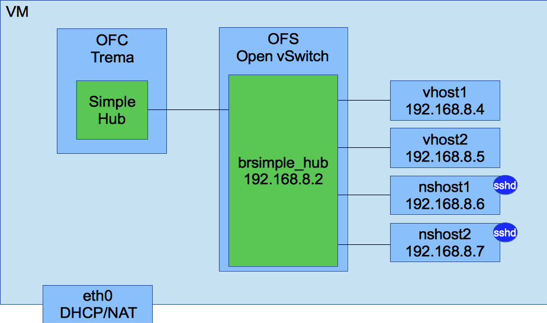

# Trema netns test

This repository is to provide Trema netns test environment which can run the tests on it.

Trema is an OpenFlow controller framework in Ruby.
This repository includes Vagrant and Virtual Box.
So, you can run tests with easily.

## How to build the environment

You can build the environment with following commands.

```
$ git clone https://github.com/otahi/trema-netns-test.git
$ cd trema-netns-test
$ vagrant up
$ vagrant ssh
$ cd trema
$ ./bin/trema run simple_hub.rb -c simple_hub.conf -d
$ sudo ip addr replace 192.168.8.2/24 dev brsimple_hub
$ ./bin/trema netns nshost1 /usr/sbin/sshd
$ ./bin/trema netns nshost2 /usr/sbin/sshd
```



## How to test the environment

### Test with vhosts

You can test your controller with vhosts.
You can send packets and check the number of received packets.

```
$ ./bin/trema send_packets --source vhost1 --dest vhost2 --npackets 10
$ ./bin/trema show_stats vhost2
```

### Test with netns

You can test your controller with netns.

You can ping.
```
$ ./bin/trema netns nshost1 -- ping -c1 192.168.8.7
```

You can send packet and check the captured packets by tcpdump.
(Before run `nc`, you need to run `tcpdump`)

```
$ ssh -t 192.168.8.7 sudo tcpdump -n port 80
```

```
$ ssh 192.168.8.6 nc -zv 192.168.8.7 80
```

### Test with test frameworks

You can test your controller with test frameworks such as Serverspec or Infrataster.
You can use common test cases for a test network and a real network.

```
$ bundle exec rake spec:192.168.8.6
```

```
$ bundle exec rake spec:simple_hub
```

## See also

[Run Run Trema Test](http://www.slideshare.net/HiroshiOta2/run-run-trema-test)
